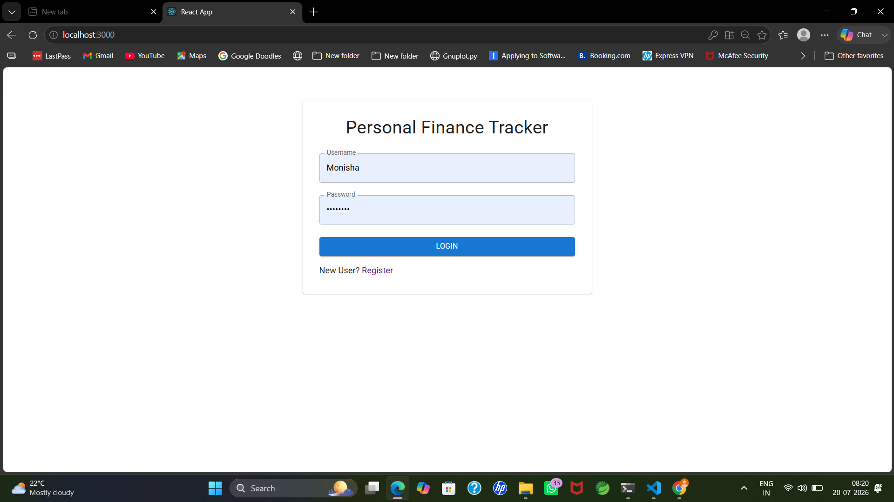
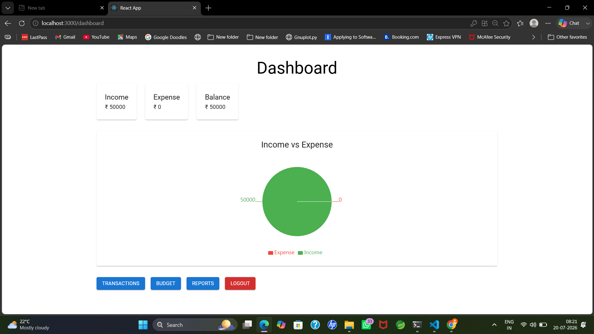
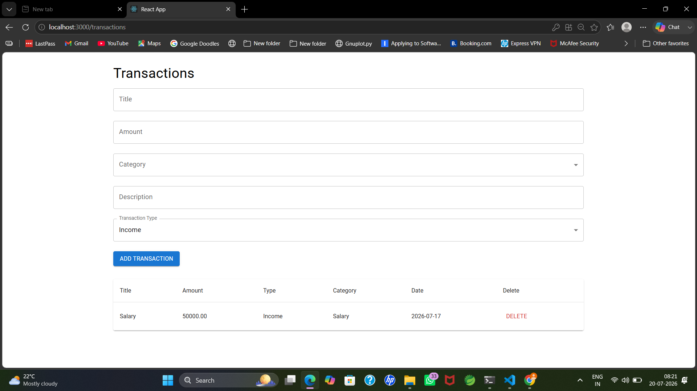
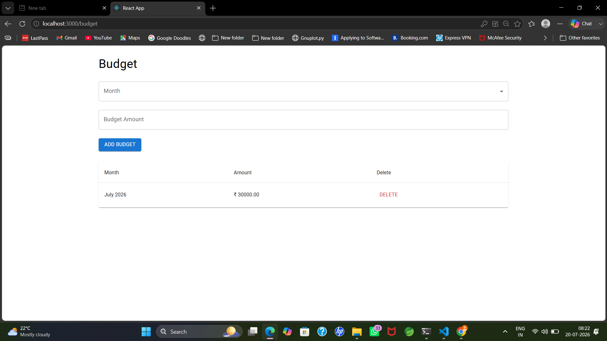
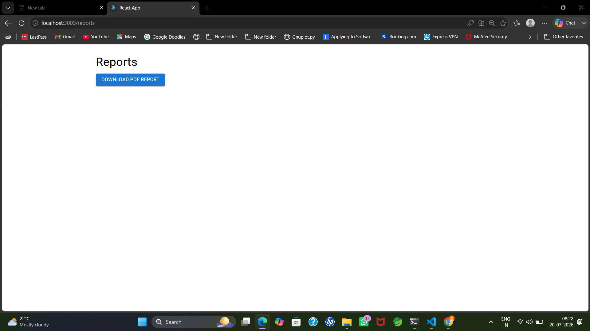
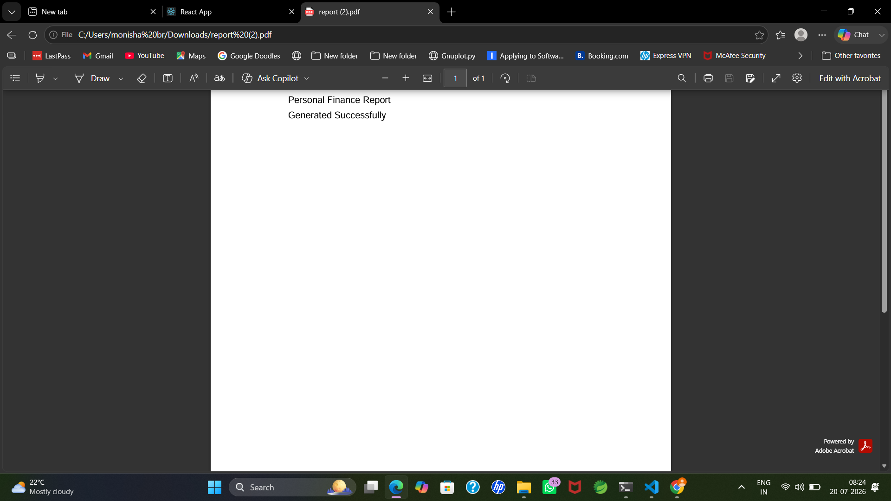

# 💰 Personal Finance Tracker

A full-stack Personal Finance Tracker built using Django REST Framework and React. It allows users to securely manage income, expenses, monthly budgets, and generate PDF reports with interactive dashboard analytics.

## 🚀 Features

- 🔐 JWT Authentication
- 📊 Dashboard with Income, Expense & Balance Summary
- 📈 Interactive Pie Chart Visualization
- 💵 Add, View & Delete Transactions
- 🎯 Monthly Budget Management
- 📄 Download Financial Report as PDF
- 📱 Responsive Material UI Interface

## 🛠 Tech Stack

### Frontend
- React.js
- Material UI
- Axios
- Recharts

### Backend
- Django
- Django REST Framework
- JWT Authentication
- SQLite
- ReportLab

## 📂 Project Structure

```text
personal-finance-tracker/
│
├── backend/
│   ├── users/
│   ├── transactions/
│   ├── budgets/
│   ├── reports/
│   └── finance_tracker/
│
└── frontend/
    ├── src/
    ├── public/
    └── package.json
```













## ⚙ Installation

### Clone Repository

```bash
git clone https://github.com/Monisha-b-r/personal-finance-tracker.git
```

### Backend

```bash
cd backend

python -m venv venv

venv\Scripts\activate

pip install -r requirements.txt

python manage.py migrate

python manage.py runserver
```

### Frontend

```bash
cd frontend

npm install

npm start
```

## Future Improvements

- PostgreSQL
- Docker
- CI/CD
- Email Notifications
- Monthly Analytics
- Cloud Deployment

## Author

**Monisha B R**

LinkedIn:
www.linkedin.com/in/monisha-b-r-049875239

GitHub:
https://github.com/Monisha-b-r
